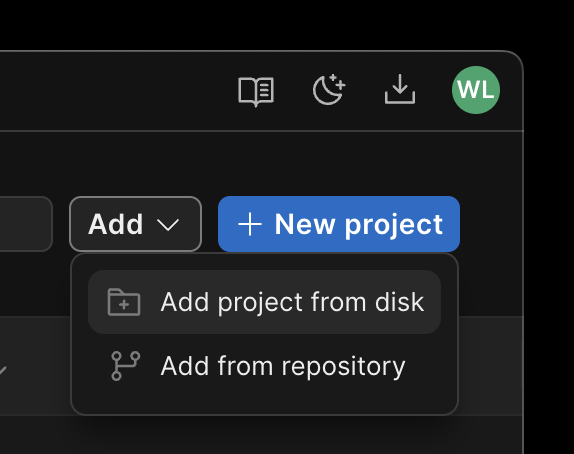
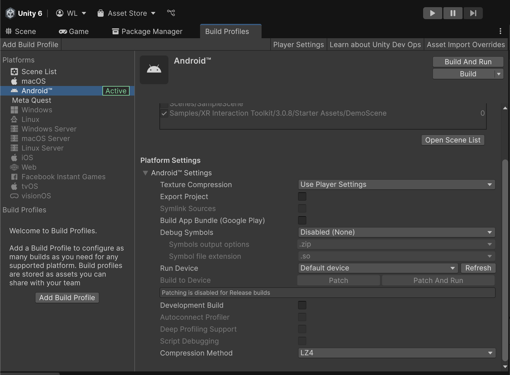
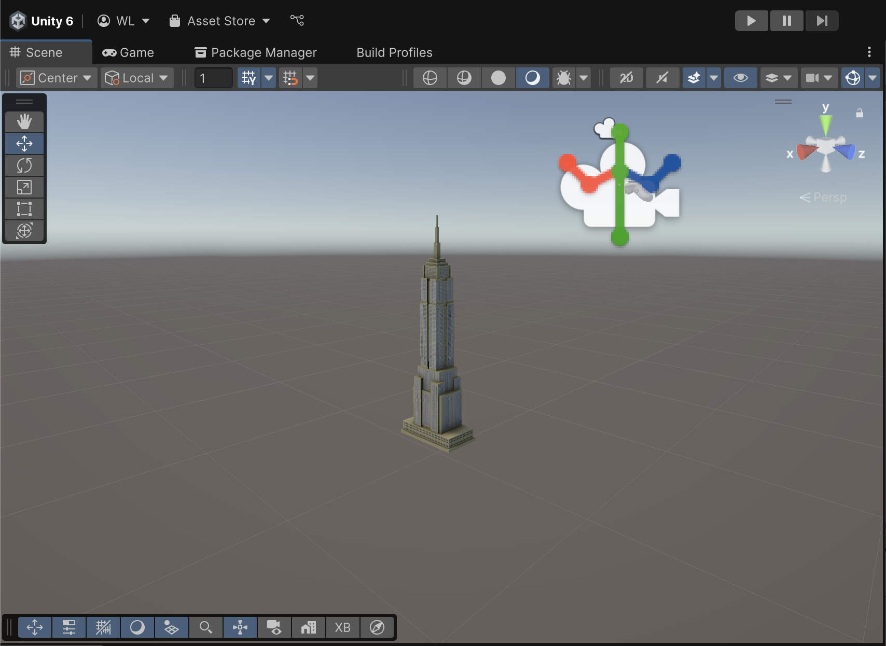

# Speed Mixed Reality

Configured project for Meta Quest 3 Mixed Reality Applications

# Quick Start

- Clone the project to your computer
- Use UnityHub to open the project

- Make sure the build settings are switched to android and you are building the DemoScene

# Scene Description

The current scene comes set up with a 1.5 m tall empire state model placed at floor level